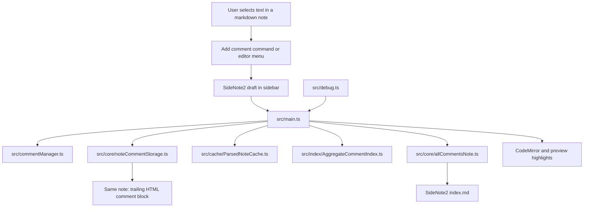

# SideNote2 Development

Development notes for `SideNote2`. The main [README.md](./README.md) stays product-level; this file is for setup, internals, and testing.

Release steps live in [README-release.md](./README-release.md). Beta rollout steps live in [README-beta-release.md](./README-beta-release.md). QA steps live in [README-qa.md](./README-qa.md).

## Architecture

- High-level flow:



- `src/main.ts`
  Plugin lifecycle, command registration, sidebar drafting and editing flow, note syncing, aggregate note refresh, and editor or preview highlights.
- `src/commentManager.ts`
  In-memory comment list, anchor lookup, and coordinate updates after note edits.
- `src/core/noteCommentStorage.ts`
  Parses and serializes the trailing hidden `<!-- SideNote2 comments -->` block.
- `src/cache/ParsedNoteCache.ts`
  Small parsed-note cache used to avoid repeated full-note parsing.
- `src/index/AggregateCommentIndex.ts`
  Vault-wide aggregate comment index used to build `SideNote2 index.md`.
- `src/core/allCommentsNote.ts`
  Builds the vault-wide `SideNote2 index.md` jump index.
- `src/debug.ts`
  Opt-in debug logging and debug store globals.

- Runtime model:
  - The note itself is the only persisted source of truth for comment data.
  - The sidebar is an in-memory view over the active note plus any current draft.
  - `SideNote2 index.md` is generated from the note-backed comment index and is not the source of truth.
  - Resolved comments stay in note JSON, can be shown in the sidebar, and can be highlighted when the resolved toggle is on.
  - A small parsed-note cache and aggregate comment index reduce repeated full-note and full-vault work.

## Storage

Each note stores comments in a trailing hidden `<!-- SideNote2 comments -->` block:

````md
<!-- SideNote2 comments
[
  {
    "id": "comment-1",
    "startLine": 2,
    "startChar": 6,
    "endLine": 2,
    "endChar": 10,
    "selectedText": "beta",
    "selectedTextHash": "sha256...",
    "comment": "Keep this compact.",
    "timestamp": 1710000000000,
    "resolved": false
  }
]
-->
````

The stored payload includes coordinates and a text hash so anchors can be re-matched after edits. The block is hidden in Reading view, but still present in raw markdown for source-mode workflows and LLM ingestion.

## Dependencies
### Current Model

- The plugin bundles no third-party runtime dependencies.
- Obsidian, Electron, CodeMirror, Lezer, and Node built-ins stay external at bundle time.

### Package-managed

From `package.json`:

| Group | Packages | Purpose |
| --- | --- | --- |
| Build | `typescript`, `esbuild`, `builtin-modules`, `tslib` | Type-check, bundle, externalize Node built-ins, and support TS helper imports |
| Obsidian API | `obsidian` | Plugin API typings and build target |
| Node types | `@types/node` | Node typings for tests and build scripts |
| Linting | `@typescript-eslint/parser`, `@typescript-eslint/eslint-plugin` | TypeScript-aware ESLint support |

### Runtime Externals

Left unbundled in `esbuild.config.mjs`:

| Group | Externals |
| --- | --- |
| Obsidian runtime | `obsidian`, `electron` |
| CodeMirror | `@codemirror/autocomplete`, `@codemirror/collab`, `@codemirror/commands`, `@codemirror/language`, `@codemirror/lint`, `@codemirror/search`, `@codemirror/state`, `@codemirror/view` |
| Lezer | `@lezer/common`, `@lezer/highlight`, `@lezer/lr` |
| Node built-ins | Added through `builtin-modules` in the build config |


## Run

```bash
cd "/path/to/SideNote2"
npm install
npm run dev
```

- Keep `npm run dev` running while testing.
- `npm run build` creates a production bundle.
- `npm test` runs the Node test suite.
- `npm run skill:install` copies the packaged SideNote2 Codex skill into the default Codex skills directory. This matches the end-user install flow.
- `npm run comment:update -- --file "/abs/path/note.md" --id "<comment-id>" --comment-file "/abs/path/comment.md"` updates one stored comment body using the same managed block format as the plugin.
- `npm version patch|minor|major` updates `package.json`, `manifest.json`, `versions.json`, and the beta release docs together for a release bump.
- The test suite covers the note-backed comment lifecycle, comment retargeting and pruning, JSON storage updates, aggregate note generation, and the parsed-note cache plus aggregate index behavior.

The canonical repo skill lives in `skills/side-note2-note-comments/`.
When Codex is working in this repo, use that repo-local skill directly. There is no separate sync or link step for development.
Use `npm run skill:install` only when you want to test the user-style global Codex skill install flow on this machine.

For user or agent comment edits outside the UI, find the target `id` in the trailing `<!-- SideNote2 comments -->` block in source mode, then run the helper script instead of hand-editing escaped JSON.

## Local Install

Install the plugin into your vault with:

```bash
VAULT="/path/to/your/vault"
REPO="/path/to/SideNote2"
PLUGIN_ID="side-note2"
PLUGIN_DIR="$VAULT/.obsidian/plugins/$PLUGIN_ID"

mkdir -p "$VAULT/.obsidian/plugins"
if [ -L "$PLUGIN_DIR" ]; then rm "$PLUGIN_DIR"; fi
ln -s "$REPO" "$PLUGIN_DIR"
```

Then open that vault in Obsidian and enable `SideNote2` under community plugins.

## Reload

If Obsidian feels stale during development, reload the plugin from DevTools:

- For Mac, use `Command + option + i` to inspect, then switch to the `Console` tab and run:

```js
await app.plugins.disablePlugin("side-note2");
await app.plugins.enablePlugin("side-note2");
```

## Debugging

Debug logging is opt-in and lives in `src/debug.ts`.

Enable or disable it in `Settings > SideNote2 > Debug mode`.

Inspect:

```js
window.__SIDENOTE2_DEBUG__;
window.__SIDENOTE2_DEBUG_STORE__;
```
