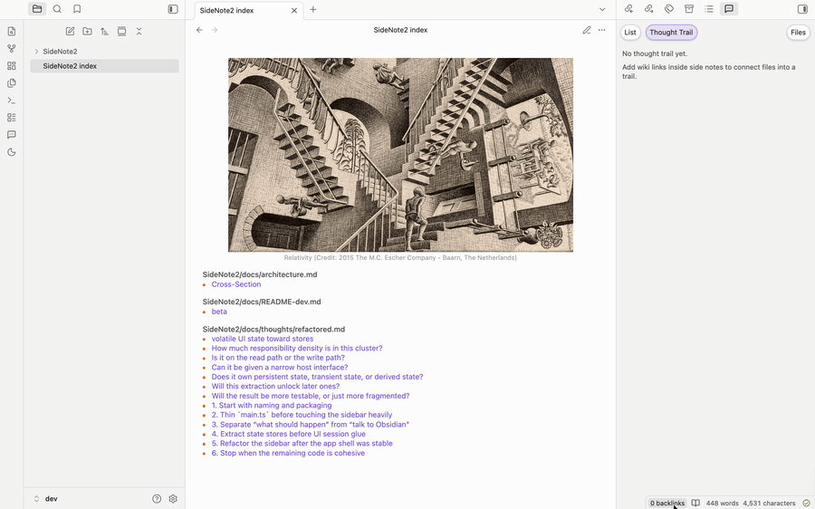

# SideNote2
<p align="center">
  
</p>
<p align="center">
  <a href="https://github.com/vicky469/SideNote2/releases/tag/2.0.11">
    
  </a>
</p>
<p align="center">
  <a href="https://obsidian.md">
    
  </a>
  <a href="https://www.typescriptlang.org/">
    
  </a>
  <a href="https://codemirror.net/">
    
  </a>
  <a href="https://lezer.codemirror.net/">
    
  </a>
</p>
<p align="center">
  
</p>

SideNote2 is an [Obsidian](https://obsidian.md) plugin for side comments that stay attached to the note.

It is built for a minimal workflow: humans work in the sidebar, while agents can read the same comments directly from the markdown file. Inspired by [mofukuru/SideNote](https://github.com/mofukuru/SideNote).

## Features

- Uses a dedicated sidebar for drafting, editing, resolving, reopening, and deleting comments.
- Supports Obsidian-style `[[wikilinks]]` inside side comments to link existing notes or create new markdown notes.
- Type `#` in a side note to search existing tags or add a new one.
- Keeps resolved comments archived instead of removing them.
- Generates `SideNote2 index.md` as a vault-wide comment index.
- Lets the index sidebar switch between the comment list and a thought-trail graph built from side-note wiki links. The graph follows those links across connected markdown files, so it can show multi-step trails instead of only direct one-hop links.
- Supports agent workflows so Codex, Claude Code, and other assistants can read and update side comments from the note-backed storage format.

## How to Get Started

1. Install BRAT
   settings -> install community plugins -> BRAT
2. Install the SideNote2 beta
   Open BRAT, enable Auto update if you want, then add the plugin as shown below.
   <p align="center">
     
   </p>
3. Optional: install the `sidenote2` skill for agent workflows. The Agent Skills specification is an [open standard](https://github.com/agentskills/agentskills), used by a range of different AI systems.
   For example, in codex: 
```text
Use the skill-installer skill and install:
https://github.com/vicky469/SideNote2/tree/main/skills/sidenote2
```

Or store [`skills/sidenote2/SKILL.md`](./skills/sidenote2/SKILL.md)  in your home directory (`~/.claude/skills`, or `~/.agents/skills`).

4. Restart Codex, then run `/skills`.
   You should see `sidenote2`.

## Workflow

1. Select text in a note.
2. Right-click `Add comment to selection`.
   You can use the ribbon button to open the sidebar, or assign your own hotkey in Obsidian.
3. Write the comment in the sidebar.
   See `Writing in Side Notes` below for editor shortcuts and formatting behavior.
4. Review it later from the sidebar, from `SideNote2 index.md`, or from the sidebar thought trail.

## Writing in Side Notes

| Action | How it works |
| --- | --- |
| Save draft | Click `Save`. |
| Insert a newline | Press `Enter`. |
| Link a note | Type `[[` to open note suggestions and insert an Obsidian wikilink. |
| Add a tag | Type `#` to open tag suggestions and insert a tag. |
| Reopen link or tag suggestions | Press `Tab` while the cursor is inside an unfinished `[[...` or `#...` token. |
| Bold or highlight text | Use the sidebar `B` and `H` buttons to wrap the current selection with `**bold**` or `==highlight==`. |
| Cancel a draft or edit | Press `Esc`. |

## Agent Workflow

1. In SideNote2, click  on the comment you want to send to an agent.
   This copies an `obsidian://side-note2-comment?...` link.
2. Paste that link into Codex, Claude Code, Kimi Code, or another assistant with the `sidenote2` instructions installed.
3. Ask one of these:
   - `reply to this`
   - `update this side note to: ...`
   - `resolve this side note`

The `sidenote2` skill tell the agent to use the real markdown note as source of truth and to safely append, update, or resolve the stored comment/thread.

## Settings

- `Index header image URL`
- `Index header image caption`

## Command

- `SideNote2: Add comment to selection`

## Storage

For MD files:
Each note stores its comments in a trailing hidden `<!-- SideNote2 comments -->` JSON block inside the same markdown file.

For PDF files:
The JSON block is stored in plugin data.

`SideNote2 index.md` is just a generated index, not separate storage.

## Index Surfaces

- `SideNote2 index.md` stays a derived vault-wide aggregate note.
- The index sidebar `Files` filter only scopes the sidebar view. Selecting one file there does not rewrite `SideNote2 index.md` down to that single file section.
- In the index sidebar list view, the nested-comments toggle is hidden when the filter scope resolves to exactly one file.
- The generated index note only shows a visibility banner in resolved-only mode.

## Changelog

## License

MIT
