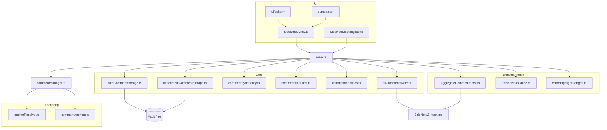
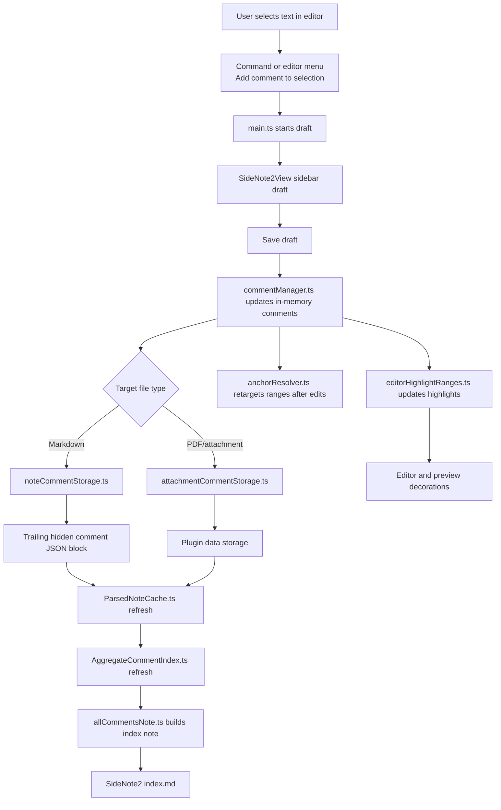
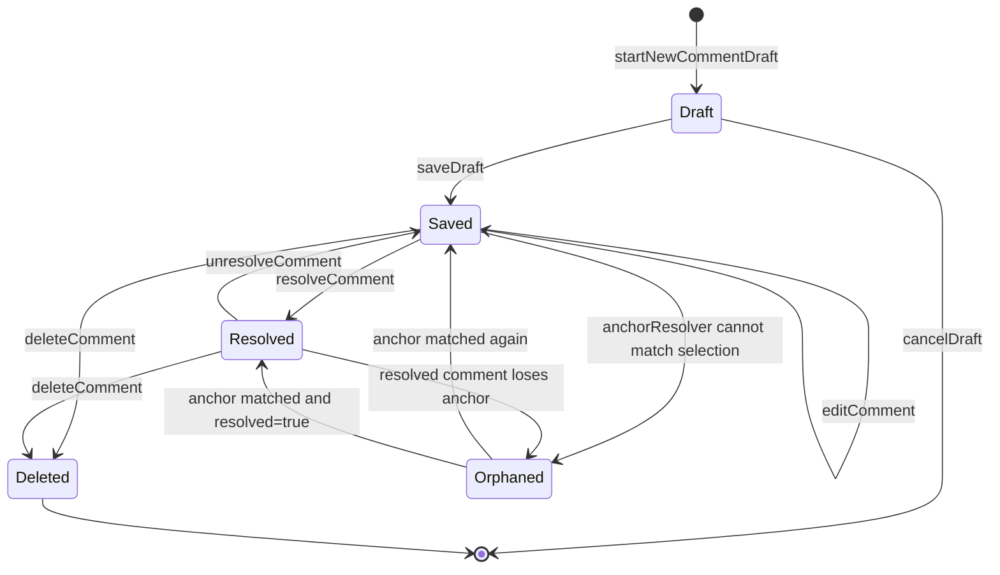

# SideNote2 Architecture

This note is meant to make the codebase easier to read visually.

Use three lenses:

- Blueprint: static module boundaries and ownership.
- Transit map: how data and events move.
- State machine: how a comment changes over time.

## 1. Module Blueprint

Read this as the structural map of the plugin.

- `src/main.ts` is the orchestrator.
- `src/commentManager.ts` owns the in-memory comment list.
- `src/core/*` handles storage, anchors, sync policy, derived metadata, and file rules.
- `src/ui/*` handles the sidebar view, editor helpers, settings, and modals.
- `src/index/*` and `src/cache/*` support derived or accelerated views of note-backed data.

## 2. Comment Route Map

Read this as the movement of one comment through the system.

## 3. Comment Lifecycle State Machine

Read this when debugging a specific comment.

- `draft` is UI-only and not yet persisted.
- `saved` means persisted in markdown or attachment storage.
- `resolved` is still stored, but normally hidden in the sidebar.
- `orphaned` means the stored comment still exists, but its anchor could not currently be matched back to the file text.

## 4. How To Use These Diagrams

### When you are reading code

- Start with `Module Blueprint` to find which layer owns the behavior.
- Use `Comment Route Map` when you want to know where data came from or where it is written.
- Use `Comment Lifecycle State Machine` when a bug is really about status, visibility, or retargeting.

### When you are debugging

Use this shortcut table:

| Symptom | First files to inspect |
| --- | --- |
| Draft does not save or disappears | `src/main.ts`, `src/ui/views/SideNote2View.ts`, `src/domain/drafts.ts` |
| Comment saved but not persisted to note | `src/core/noteCommentStorage.ts`, `src/core/attachmentCommentStorage.ts`, `src/core/commentSyncPolicy.ts` |
| Comment exists but highlight is wrong | `src/core/anchorResolver.ts`, `src/core/editorHighlightRanges.ts`, `src/commentManager.ts` |
| Sidebar shows wrong grouping or visibility | `src/ui/views/sidebarCommentSections.ts`, `src/ui/views/SideNote2View.ts`, `src/commentManager.ts` |
| Index note is stale or wrong | `src/index/AggregateCommentIndex.ts`, `src/core/allCommentsNote.ts`, `src/cache/ParsedNoteCache.ts` |
| Wiki links or tags inside comments behave incorrectly | `src/ui/editor/commentEditorLinks.ts`, `src/ui/editor/commentEditorTags.ts`, `src/core/commentMentions.ts` |

## 5. Mental Model

SideNote2 is easiest to understand if you keep one rule in mind:

- The note-backed comment data is the source of truth.
- The sidebar is a working view over that data plus any current draft.
- The index note and highlights are derived views.

That means most bugs reduce to one of three questions:

1. Was the canonical comment data loaded correctly?
2. Was it transformed correctly into UI or index state?
3. Was the anchor still resolvable after the file changed?
